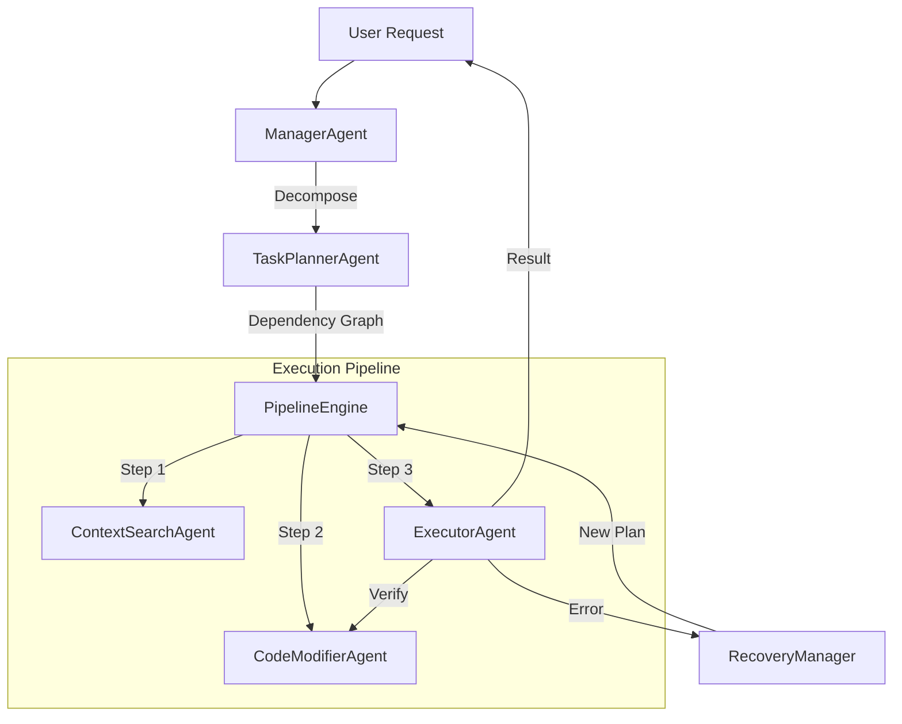

# Changelog

All notable changes to the **Byte Coder AI Agent** extension will be documented in this file.

The format is based on [Keep a Changelog](https://keepachangelog.com/en/1.0.0/),
and this project adheres to [Semantic Versioning](https://semver.org/spec/v2.0.0.html).

---

## [1.0.3] - 2026-01-31

### 🔄 Autonomous Agent Architecture Update
This release marks a major evolution for Byte Coder, enhancing its capabilities as a fully autonomous software engineering agent. The "Pipeline" architecture has been refined to strictly follow a "Think-Act-Verify" loop.

### ✨ New Features
- **Strict "Think-Act-Verify" Pipeline**: A formalized execution loop where every action is planned, executed, and then verified.
- **SEO & Marketplace Optimization**: Optimized package metadata for better discoverability and SEO on VS Code Marketplace.
- **Enhanced Documentation**: Updated README with detailed architectural diagrams and screenshots of the new interface.
- **Improved Action Reliability**: The agent now generates strict `<byte_action>` XML tags, eliminating ambiguity in file operations.
- **Visual Process Diagrams**: Added detailed ASCII diagrams in `AgentOrchestrator.ts` to explain the internal decision-making process.

### 🐛 Bug Fixes
- **Activation Events**: Fixed `activationEvents` warning in `package.json` by removing redundant entries.
- **Confirmation Loop Fix**: Resolved an issue where the agent would repeatedly ask for confirmation instead of executing actions.
- **TypeScript & Linting Fixes**: Corrected 276+ linting errors and resolved TypeScript compilation issues in `BetterChatUI.ts`.
- **Regex Safety**: Fixed invalid regular expressions in `BetterChatUI.ts` that caused syntax errors.
- **System Prompt Hardening**: Updated the core system prompt to enforce XML tag usage and prevent markdown confusion.

### 🔧 Technical Improvements
- **Agent Orchestrator Refactor**: Cleaned up the core orchestration logic to better handle complex multi-step tasks.
- **Security Audit**: Addressed moderate severity vulnerabilities in dependencies.
- **Codebase Standardization**: Enforced strict naming conventions and type safety across the codebase.

## [1.0.2] - 2026-01-25

### 🚀 Major Release: Autonomous Agent & Knowledge Integration
This release transforms Byte Coder from a chat assistant into a fully autonomous agent capable of planning, executing, and recovering from complex tasks. It also introduces strict knowledge enforcement for identity and factual accuracy.

### ✨ New Features
- **Dynamic Implementation Plan**: A new UI drawer that visualizes the agent's plan, showing real-time progress, todo items, and status.
- **Autonomous Pipeline Engine**: A new robust execution engine that orchestrates specialized agents to complete tasks.
- **Auto-Recovery & Backtracking**: If a step fails (e.g., syntax error), the agent now automatically plans recovery tasks to fix the issue.
- **Knowledge Base Integration**: Packaged `uthakkan_data.json` with the extension for offline access to core knowledge.
- **Strict Identity Enforcement**: The AI now strictly adheres to its identity as a creation of "Ajmal U K" and "UTHAKKAN".
- **Context Prioritization**: Knowledge base results are now prepended to the chat context, ensuring high visibility for the model.

### 🏗️ System Architecture
The new 1.0.2 architecture introduces a sophisticated pipeline for autonomous execution:



### 🤖 Agent Roles & Responsibilities

| Agent | Type | Role | Key Capabilities |
|-------|------|------|------------------|
| **ManagerAgent** | Orchestrator | The "Brain" of the system | Analyzes intent, routes requests, manages high-level strategy. |
| **TaskPlannerAgent** | Planner | Project Manager | Breaks down complex goals into topological dependency graphs (DAGs). |
| **ContextSearchAgent** | Researcher | Information Gatherer | Dual-path search (Knowledge Base + Workspace) to find relevant context. |
| **CodeModifierAgent** | Worker | Surgical Surgeon | Performs precise AST-based code edits with rollback capabilities. |
| **ExecutorAgent** | Worker | Runtime Engineer | Executes shell commands, runs tests, and validates file operations. |
| **TodoManagerAgent** | Tracker | Safety Officer | Tracks progress, prevents infinite loops (max 3 retries), and manages state. |

### 🐛 Bug Fixes
- **VSIX Packaging**: Fixed issue where `src/data` was excluded from the package; moved to `./data`.
- **Chat Context**: Fixed fallback search logic to prioritize knowledge base results.
- **Intent Classification**: Boosted "Explain" intent for direct questions (Who/What/Where) to prevent accidental code generation.
- **Infinite Loops**: Added retry limits to `TodoManagerAgent` to prevent endless recovery cycles.

### 🔧 Technical Improvements
- **Dual-Path Resolution**: `ContextSearchAgent` now checks both extension root and workspace for knowledge files.
- **Loop Detection**: Added `retryCount` to `TaskNode` interface to track and limit task attempts.
- **Context Authority**: Enhanced `PipelineEngine` to explicitly label knowledge base results as the "Primary Source of Truth".
- **System Prompt Hardening**: Updated `byteAIClient.ts` to strictly enforce identity constraints at the prompt level.

### 📁 Files Changed
| File | Changes |
|------|---------|
| `package.json` | Version bump (1.0.2), Activation Events |
| `src/data/` | Moved from `src/data` to `./data` for VSIX inclusion |
| `src/agents/ContextSearchAgent.ts` | Dual-path resolution, stop-word updates |
| `src/core/PipelineEngine.ts` | Knowledge context prioritization |
| `src/agents/TodoManagerAgent.ts` | Retry limit implementation |
| `README.md` | New "Offline Knowledge & Identity" section |

---

## [1.0.1] - 2026-01-16

### 🎉 Highlights
This patch release focuses on improving chat session management, fixing critical streaming issues, and adding keyboard navigation for popup menus.

### ✨ New Features
- **Arrow Key Navigation for Popups**: Navigate through `@` file mentions and `/` slash commands using **Arrow Up/Down** keys. Press **Enter** or **Tab** to select the highlighted item.
- **Session Restoration**: Chat sessions are now automatically restored when you reopen VS Code, so you can continue right where you left off.
- **Improved Message Tracking**: Added proper tracking of assistant message indices for more reliable message updates during streaming.

### 🐛 Bug Fixes
- **Fixed Streaming State Issues**: Resolved an issue where the streaming state was not properly reset when sending new user messages, which could cause responses to appear in the wrong message bubble.
- **Fixed Message History Sync**: Assistant messages are now properly synced with the message history during streaming, ensuring chat exports and session saves are accurate.
- **Fixed Session Loading**: Improved session loading to properly reset streaming state and hide thinking indicators, preventing ghost UI elements.
- **Fixed Error State Handling**: Error states now properly clean up streaming state, preventing the UI from getting stuck in a "generating" state.

### 🔧 Technical Improvements
- Added `currentAssistantMessageIndex` tracking for precise message updates
- Implemented `restoreLastSession()` method in `ChatViewProvider.ts` for automatic session recovery
- Enhanced `loadSession` handler to properly reset all streaming state
- Improved state persistence with `persistState()` calls after generation completes
- Added `commandPopupSelectedIndex` and `filePopupSelectedIndex` for keyboard navigation state
- Implemented `updateCommandPopupSelection()` and `updateFilePopupSelection()` helpers
- Enhanced keydown handler with ArrowUp/ArrowDown/Tab support for popup navigation

### 📁 Files Changed
| File | Changes |
|------|---------|
| `src/ChatViewHtml.ts` | +100 lines (keyboard navigation, session restoration, message tracking) |
| `src/ChatViewProvider.ts` | +15 lines (restoreLastSession implementation) |

---

## [1.0.0] - 2026-01-16

### 🎉 Initial Release

The first official release of **Byte Coder AI Agent** - your intelligent, context-aware coding companion.

### ✨ Features

#### 🤖 Multi-Agent Architecture
- **IntentAnalyzer Agent**: Understands your coding intent and extracts relevant keywords
- **FileFinder Agent**: Intelligently discovers relevant files in your workspace
- **CodeExtractor Agent**: AST-aware extraction of relevant code sections
- **RelevanceScorer Agent**: Scores and ranks code snippets for optimal context

#### 💬 Premium Chat Experience
- **Glassmorphism UI**: Beautiful, modern interface with smooth animations
- **@ File Mentions**: Reference any file in your workspace by typing `@`
- **/ Slash Commands**: Quick actions for common tasks (`/explain`, `/fix`, `/refactor`, etc.)
- **Session History**: Persistent conversation history with quick access drawer
- **Export to Markdown**: Save your conversations for documentation

#### ⌨️ Context Actions
- **Explain Selection** (`Cmd+Alt+E`): Get detailed explanations of selected code
- **Fix Bugs** (`Cmd+Alt+F`): Automatically detect and fix issues
- **Refactor Code** (`Cmd+Alt+R`): Improve code structure and readability
- **Quick Ask** (`Cmd+Alt+A`): Ask custom questions about selected code
- **Generate Tests**: Create unit tests for your code
- **Generate Docs**: Add documentation and comments
- **Optimize Performance**: Get optimization suggestions
- **Security Audit**: Check for security vulnerabilities
- **Code Review**: Get comprehensive code reviews

#### 🎨 UI/UX Highlights
- Dynamic theming that adapts to your VS Code theme
- Real-time streaming responses with typing indicators
- Copy code blocks with one click
- Stop generation anytime
- Responsive design for all panel sizes

#### ⚙️ Configuration Options
- Custom instructions to personalize AI behavior
- Auto-context mode for intelligent file gathering
- Debug mode for search agent transparency

### 📦 Technical Details
- Built with TypeScript for VS Code
- WebSocket-based communication for real-time streaming
- Semantic code search capabilities
- Context-aware file analysis

---

## How to Update

To update to the latest version:
1. Open VS Code
2. Go to Extensions (`Cmd+Shift+X`)
3. Find "Byte Coder AI Agent"
4. Click "Update" if available

Or install directly:
```bash
code --install-extension uthakkan.byte-coder-ai-agent
```

---

## Support

- **Issues**: [GitHub Issues](https://github.com/ajmal-uk/byte-coder-ai-agent/issues)
- **Sponsor**: [Buy Me a Coffee](https://www.buymeacoffee.com/ajmal.uk)
- **Website**: [uthakkan.pythonanywhere.com](https://uthakkan.pythonanywhere.com)
