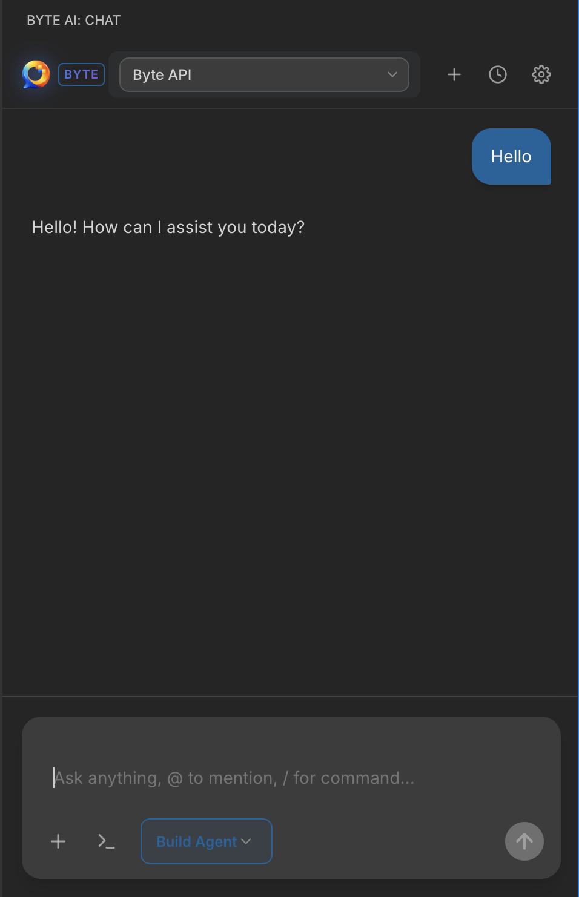
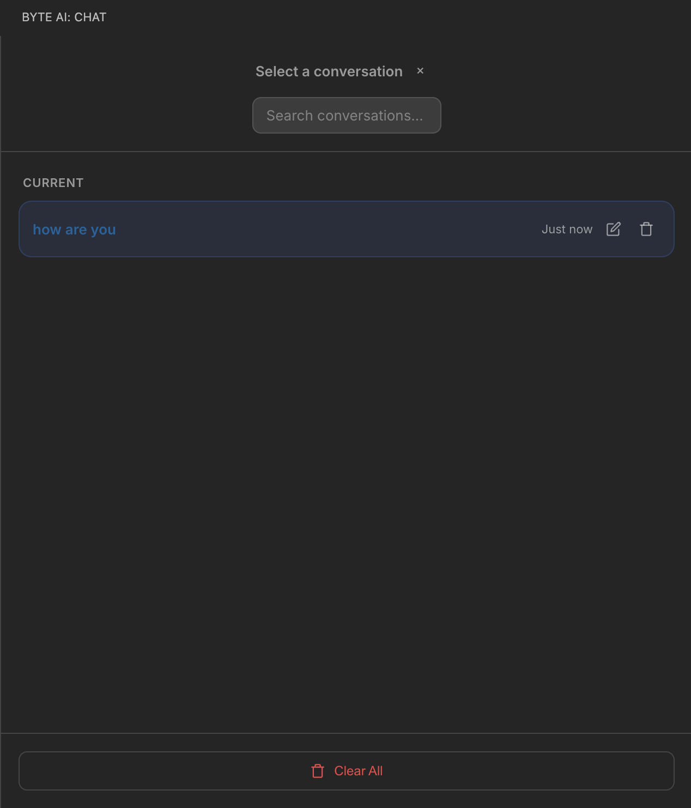
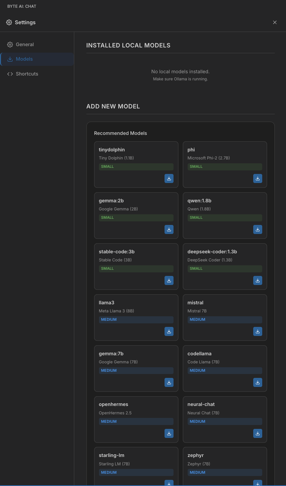
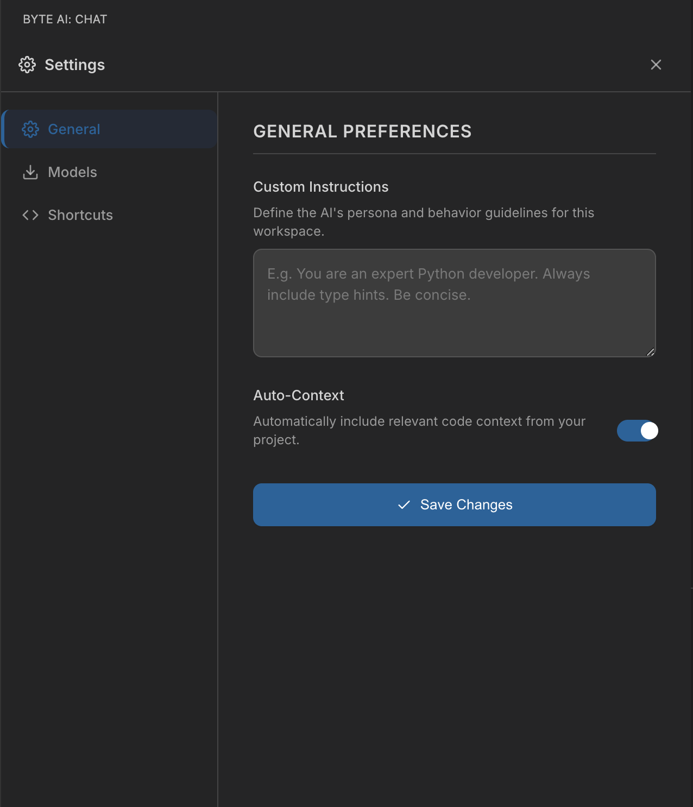

<div align="center">
  
  <h1>Byte Coder AI Agent - The Autonomous Software Engineer</h1>
  <p><b>🚀 The Autonomous AI Software Engineer for VS Code | Better than Copilot</b></p>
  <p><i>Plan. Execute. Verify. | Powered by Multi-Agent Architecture</i></p>
  
  [](https://marketplace.visualstudio.com/items?itemName=uthakkan.byte-coder-ai-agent)
  [](https://marketplace.visualstudio.com/items?itemName=uthakkan.byte-coder-ai-agent)
  [](https://marketplace.visualstudio.com/items?itemName=uthakkan.byte-coder-ai-agent)
</div>

---

> **Byte Coder** is not just a chat extension — it is an **autonomous software engineering agent** capable of handling complex development tasks end-to-end. Powered by a sophisticated **Multi-Agent "Think-Act-Verify" Architecture**, it understands your codebase, plans multi-step solutions, executes file operations, and verifies its own work.

> **Privacy Focused**: Your code stays private. Byte Coder runs locally or connects securely to trusted cloud providers.

---

## 📸 Experience Byte Coder

<div align="center">
  
  <p><i><b>Intelligent Chat Interface</b>: Context-aware conversations with your codebase</i></p>
</div>

<br/>

<div align="center">
  <table>
    <tr>
      <td align="center">
        
        <br/>
        <b>Session History</b>
      </td>
      <td align="center">
        
        <br/>
        <b>Model Management</b>
      </td>
    </tr>
  </table>
</div>

---

## 🚀 Why Byte Coder?

Most AI tools are passive text generators. **Byte Coder is an active agent.**

*   **🧠 "Think-Act-Verify" Loop**: It doesn't just guess code; it plans a solution, writes the files, and checks for errors.
*   **📂 Deep Context Awareness**: Automatically discovers relevant files, reads imports, and understands project structure.
*   **🛡️ Safe Execution**: All file operations are presented for your review before execution.
*   **⚡ Parallel Execution**: Multiple specialized sub-agents work in parallel to solve tasks faster.

---

## 🛠️ Core Capabilities

### 1. Autonomous Task Execution (New in v1.0.3)
Byte Coder can now handle complex requests like "Create a React component for UserProfile and add it to the router":

*   **Manager Agent**: Analyzes your request and determines the intent.
*   **Architect Agent**: Designs the system structure if needed.
*   **Task Planner**: Breaks the goal into a dependency graph of executable tasks.
*   **Execution Engine**: Writes code, runs commands, and modifies files.

### 2. Intelligent Codebase Search
Stop manually copy-pasting files. Byte Coder finds what it needs:
*   **Semantic Search**: Finds code by concept (e.g., "auth logic" finds `LoginController.ts`).
*   **AST Extraction**: Reads full function definitions and class structures.
*   **Smart Context**: Auto-includes relevant imports and types.

### 3. Premium Developer Experience
*   **Glassmorphism UI**: Beautiful, translucent interface that fits right into modern VS Code.
*   **Slash Commands**: Quick actions like `/fix`, `/refactor`, `/test`, `/explain`.
*   **One-Click Actions**: Right-click any code to Explain, Refactor, or Find Bugs.

---

## 🏗️ Multi-Agent Architecture

Byte Coder operates as a system of specialized agents, each with a distinct role:

```mermaid
graph TD
    User[User Request] --> Manager[Manager Agent]
    Manager -->|Complex Task| Architect[Architect Agent]
    Manager -->|Simple Task| Planner[Task Planner]
    Architect --> Planner
    Planner -->|Task Graph| Orchestrator[Execution Orchestrator]
    
    subgraph Execution Engine
    Orchestrator --> CodeGen[Code Generator]
    Orchestrator --> Executor[Command Executor]
    Orchestrator --> QA[QA Agent]
    end
    
    Execution Engine -->|Result| Verify[Verification]
    Verify -->|Success| User
    Verify -->|Fail| Planner
```

### The "Pipeline" Process

1.  **Phase 0: Manager Analysis** - Determines if the request is a simple question or a complex build task.
2.  **Phase 1: Planning** - The **Task Planner** creates a Directed Acyclic Graph (DAG) of necessary steps.
3.  **Phase 2: Execution** - Agents run in parallel where possible to write code, install dependencies, and fix errors.
4.  **Phase 3: Verification** - The agent validates the output against the original requirements.

---

## ⚙️ Configuration

Customize Byte Coder in `Settings > Extensions > Byte Coder AI`:



| Setting | Description | Default |
|---------|-------------|---------|
| `byteAI.customInstructions` | Define your preferred coding style or persona | `""` |
| `byteAI.autoContext` | Enable autonomous file discovery | `true` |
| `byteAI.modelProvider` | Choose between Cloud or Local (Ollama) models | `cloud` |

---

## 📦 Installation

1.  Open VS Code Extensions (`Cmd+Shift+X`).
2.  Search for **"Byte Coder AI"**.
3.  Click **Install**.
4.  Open the Byte Coder sidebar icon to start.

---

<div align="center">
  <p>Made with ❤️ by <b>Ajmal U K</b></p>
  <p><i>The Future of Coding is Agentic.</i></p>
</div>
